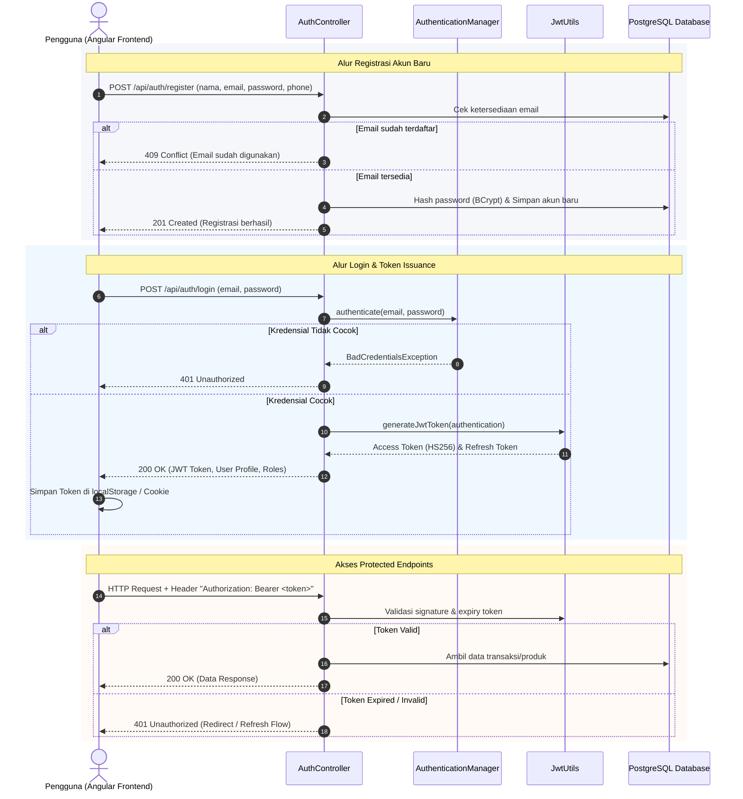
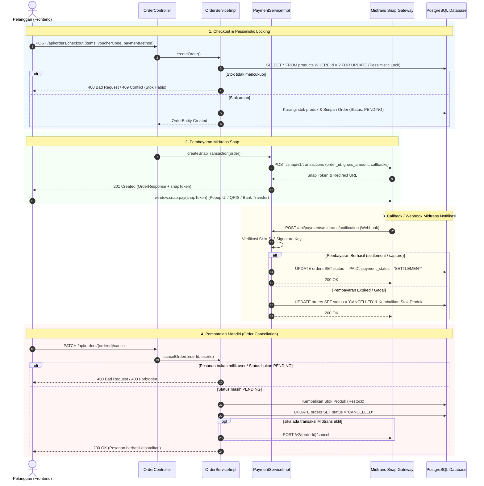

# 🛒 Fullstack E-Commerce Platform (Spring Boot 3.3 + Angular 18)

Aplikasi Web E-Commerce berskala enterprise yang dibangun menggunakan arsitektur Monorepo, memisahkan backend REST API Spring Boot (Java 21) dan frontend Single Page Application Angular 18. Proyek ini mengimplementasikan aturan rekayasa perangkat lunak modern, keamanan stateless berbasis JWT, kontrol konkurensi data (Pessimistic & Optimistic Locking), validasi berlapis, sistem ulasan & rating produk, kupon voucher dinamis, upload berkas (gambar & PDF dokumen bukti bayar), serta penanganan error global terstandarisasi.

---

## 🚀 Technology Stack

### Backend
* **Bahasa**: Java 21 (LTS)
* **Framework**: Spring Boot 3.3.5
* **Keamanan**: Spring Security 6 + JWT (`jjwt` 0.11.5) + BCrypt (Strength 12) + RBAC (Role-Based Access Control)
* **Basis Data**: PostgreSQL 16 (Relational Database)
* **ORM & Migrasi**: Hibernate / Spring Data JPA + Flyway Database Migration (V1 s/d V10)
* **Dokumentasi API**: OpenAPI 3 / Swagger UI (`springdoc-openapi` 2.6.0)
* **Email Service**: Spring Boot Starter Mail (`JavaMailSender`) terintegrasi Gmail SMTP (STARTTLS port 587)
* **File Storage**: Penyimpanan lokal aman dengan validasi MIME Type, ukuran file, ekstensi, dan header magic bytes (JPEG, PNG, WebP, dan Dokumen PDF)
* **Unit & Integration Testing**: JUnit 5 + Mockito 5 + Spring Data JPA Specification Test
* **Build Tool**: Apache Maven

### Frontend
* **Framework**: Angular 18 (Standalone Components, Signals, Reactive Forms)
* **Routing**: Angular Router dengan Route Guards (`authGuard`, `adminGuard`)
* **Styling**: Tailwind CSS & Modern Clean UI Components (Glassmorphism, Micro-animations, Responsive Design)
* **State & HTTP**: Angular `HttpClient`, RxJS Observables, Reactive Forms, HTTP Interceptor (JWT Auto-inject & 401 Handling)
* **Notifikasi**: Custom Toast Notification System (`ToastService`)
* **Unit Testing**: Karma + Jasmine Runner + ChromeHeadless

---

## 🏛️ 6 Entitas Utama Sistem (>20 Data Realistis per Entitas)

Sistem mengelola 6 entitas utama dengan relasi database terintegrasi dan soft-delete:

| No | Entitas Utama | Deskripsi & Atribut Kunci | Fitur Terkait |
|:---:|---|---|---|
| 1 | **User (Pengguna)** | ID, Nama, Email, Password (BCrypt), Phone, Role (`ADMIN`, `CUSTOMER`), `is_active`, `deleted_at` | RBAC, Profil, Admin User Management (`/admin/users`) |
| 2 | **Category (Kategori)** | ID, Nama Kategori, Deskripsi, `is_active`, `deleted_at` | Katalog Filter, Admin Category Hide/Show (`/admin/categories`) |
| 3 | **Product (Produk)** | ID, Nama Produk, SKU, Harga, Stok, Deskripsi, Kategori, Image URL, `version`, `is_active`, `deleted_at` | Optimistic Locking, Pengurangan Stok, Katalog, Admin CRUD |
| 4 | **Order (Pesanan)** | ID, User, Status (`PENDING`, `PAID`, `SHIPPED`, `DELIVERED`, `COMPLETED`, `CANCELLED`), Total Harga, Timestamp | Pessimistic Locking Stock Verification, Riwayat Pesanan Pelanggan (`/orders`), Admin Filter Tanggal (`/admin/orders`) |
| 5 | **Review (Ulasan & Rating)** | ID, Produk, User, Rating (1-5), Komentar Ulasan, Timestamp, `deleted_at` | Rangkuman Rating Bintang, Ulasan Pembeli, Form Review di Detail Produk |
| 6 | **Voucher (Kupon Diskon)** | ID, Kode Voucher, Tipe Diskon (`PERCENTAGE`, `FIXED_AMOUNT`), Nilai Diskon, Min. Belanja, Max. Diskon, Kuota, `is_active`, `deleted_at` | Validasi Kupon Real-time di Checkout, Manajemen Voucher Admin (`/admin/vouchers`) |

---

## 📁 Struktur Monorepo Proyek

```text
.
├── backend/                        # Aplikasi Backend Spring Boot
│   ├── src/main/java/com/e_commerce/backend/
│   │   ├── common/                 # DTO terstandarisasi, ApiResponse, BaseEntity
│   │   ├── config/                 # Konfigurasi JPA Auditing & Spring Web
│   │   ├── exception/              # GlobalExceptionHandler & Custom Exceptions
│   │   ├── feature_auth/           # Otentikasi, Registrasi, Forgot & Reset Password
│   │   ├── feature_order/          # Transaksi, Checkout, Locking, Specification Filter
│   │   ├── feature_product/        # Produk, Kategori, Mapper, DTO & Specification
│   │   ├── feature_review/         # Ulasan & Rating Bintang Produk
│   │   ├── feature_upload/         # Upload File Gambar & Dokumen PDF
│   │   ├── feature_user/           # Manajemen Pengguna & Admin User List
│   │   ├── feature_voucher/        # Kupon Diskon & Kalkulasi Voucher
│   │   └── security/               # Spring Security, JWT Token Filter & UserDetails
│   ├── src/main/resources/
│   │   ├── db/migration/           # Skrip Migrasi Skema Basis Data Flyway (V1 - V10)
│   │   └── application.properties  # Konfigurasi Aplikasi & Database Properties
│   ├── src/test/java/              # 111 Unit & Integration Tests (100% Green)
│   └── pom.xml                     # Konfigurasi Dependensi Maven
├── frontend/                       # Aplikasi Frontend Angular
│   ├── src/app/
│   │   ├── core/                   # Guards, Interceptors, Models, Services (API Client)
│   │   ├── features/
│   │   │   ├── admin/              # Admin: Dashboard, Produk, Kategori, Pesanan, Voucher, Users
│   │   │   ├── auth/               # Auth: Login, Register, Forgot & Reset Password
│   │   │   ├── cart/               # Keranjang Belanja Pelanggan
│   │   │   ├── catalog/            # Katalog Produk & Halaman Detail Produk
│   │   │   ├── checkout/           # Checkout & Lampiran Dokumen Bukti Bayar PDF
│   │   │   ├── dashboard/          # Dashboard Statistik Pelanggan & Admin
│   │   │   ├── orders/             # Riwayat Pesanan Pelanggan & Detail Modal
│   │   │   └── profile/            # Pengaturan Profil & Ganti Password
│   │   └── shared/                 # Layouts, Navbar, Toast, Error Pages (401, 403, 404, 500)
│   └── package.json                # Dependensi Frontend Node/Angular
├── docs/                           # Dokumentasi Arsitektur & ERD Basis Data
└── README.md                       # Dokumentasi Utama
```

---

## 📊 Diagram Alur Sistem (Flowchart)

### 1. Alur Autentikasi & Penerbitan JWT Token
Diagram berikut mengilustrasikan alur registrasi pengguna baru, proses login dengan penerbitan token JWT stateless, serta validasi request pada endpoint privat:



### 2. Alur Checkout, Pembayaran Midtrans Snap, & Pembatalan Pesanan
Diagram berikut mengilustrasikan siklus hidup pesanan lengkap: penguncian stok dengan Pessimistic Write Lock, pembuatan transaksi Midtrans Snap Sandbox, pemrosesan notifikasi Webhook, dan alur pembatalan pesanan mandiri (Order Cancellation):



---

## 🛠️ Prasyarat Sistem

Pastikan perangkat lokal Anda telah terpasang:
1. **Java Development Kit (JDK) 21**
2. **Apache Maven 3.9+** (atau gunakan wrapper bawaan)
3. **Node.js (v18.x atau v20.x LTS)** & **npm**
4. **PostgreSQL 16** (berjalan pada port default `localhost:5432`)

---

## ⚙️ Konfigurasi Environment (.env)

Aplikasi menggunakan sistem manajemen secret terpusat melalui file `.env`. 

### Langkah Setup Environment Lokal:
1. **Salin template konfigurasi `.env.example` menjadi `.env` di root project:**
   - **PowerShell (Windows):**
     ```powershell
     Copy-Item .env.example .env
     ```
   - **Bash (Linux / macOS):**
     ```bash
     cp .env.example .env
     ```
2. **Buka file `.env` dan isi variabel sensitif sesuai konfigurasi lokal Anda:**
   - `DB_PASSWORD`: Password PostgreSQL lokal Anda.
   - `JWT_SECRET`: Kunci rahasia minimal 256-bit (dapat dibuat dengan `openssl rand -base64 32`).
   - Kredensial Gmail SMTP (`MAIL_USERNAME`, `MAIL_PASSWORD` menggunakan Google App Password): Jika ingin menguji pengiriman email nyata.
3. **Jalankan backend:** Spring Boot 3.3 secara native akan membaca konfigurasi dari `.env` secara otomatis saat aplikasi dimulai. File `.env` sudah masuk ke `.gitignore` sehingga aman dan tidak akan pernah ter-commit ke Git.

### Referensi Variabel Environment:

| Variabel | Deskripsi / Tujuan | Wajib? | Contoh / Default |
|---|---|:---:|---|
| `DB_URL` | JDBC Connection URL PostgreSQL | Ya | `jdbc:postgresql://localhost:5432/ecommerce_db` |
| `DB_USERNAME` | Username akun PostgreSQL | Ya | `postgres` |
| `DB_PASSWORD` | Password akun PostgreSQL | **Ya (Sensitif)** | `your_postgres_password` |
| `JWT_SECRET` | Kunci rahasia tanda tangan JWT (min. 256-bit) | **Ya (Sensitif)** | `your_random_jwt_secret` |
| `JWT_EXPIRATION_MS` | Masa berlaku Access Token (ms) | Opsional | `3600000` (1 jam) |
| `SERVER_PORT` | Port server Spring Boot | Opsional | `8080` |
| `FRONTEND_URL` | Base URL frontend untuk reset password link | Opsional | `http://localhost:4200` |
| `MAIL_HOST` | Host server SMTP Gmail | Opsional | `smtp.gmail.com` |
| `MAIL_PORT` | Port server SMTP Gmail (STARTTLS) | Opsional | `587` |
| `MAIL_USERNAME` | Akun Gmail pengirim aplikasi | Opsional (Sensitif) | `your_app@gmail.com` |
| `MAIL_PASSWORD` | Google App Password (16 karakter) | Opsional (Sensitif) | `your_16_char_app_password` |
| `MAIL_FROM` | Alamat email pengirim (From header) | Opsional | `your_app@gmail.com` |
| `MAIL_FROM_NAME` | Nama tampilan pengirim | Opsional | `E-Commerce App` |
| `OTP_EXPIRATION_MINUTES` | Durasi berlaku kode OTP registrasi (menit) | Opsional | `5` |
| `OTP_MAX_ATTEMPTS` | Maksimal percobaan OTP salah | Opsional | `5` |
| `OTP_RESEND_COOLDOWN_SECONDS` | Cooldown kirim ulang OTP (detik) | Opsional | `60` |

---

## 🚀 Panduan Menjalankan Aplikasi Secara Lokal

### 1. Menyiapkan Basis Data PostgreSQL
Buat basis data baru bernama `ecommerce_db`:
```sql
CREATE DATABASE ecommerce_db;
```
*Catatan*: Flyway Migration akan secara otomatis membuat seluruh skema tabel (`V1` s/d `V11`) beserta data awal (seed data realistis) saat backend pertama kali dijalankan.

---

### 2. Menjalankan Backend (Spring Boot)

Buka terminal di direktori `backend`:
```powershell
.\mvnw.cmd spring-boot:run
```
Atau di Linux/macOS:
```bash
./mvnw spring-boot:run
```
*(Variabel akan otomatis dimuat dari `.env`)*

#### Windows Command Prompt (CMD):
```cmd
set DB_USERNAME=postgres&& set DB_PASSWORD=YOUR_PASSWORD&& mvn spring-boot:run
```

#### Linux / macOS:
```bash
DB_USERNAME=postgres DB_PASSWORD=YOUR_PASSWORD mvn spring-boot:run
```

* Backend akan berjalan aktif pada alamat: **`http://localhost:8080`**
* **Swagger UI / OpenAPI Dokumentasi**: **[http://localhost:8080/swagger-ui.html](http://localhost:8080/swagger-ui.html)**

---

### 3. Menjalankan Frontend (Angular)

Buka terminal baru di direktori `frontend`:
```bash
npm install
npm start
```

* Frontend akan berjalan aktif pada alamat: **`http://localhost:4200`**

---

## 🌐 Peta Navigasi & Rute Halaman

### Pelanggan (Customer Storefront)
* `/catalog` — Katalog Produk lengkap dengan filter kategori, pencarian keyword, sortir harga/nama, dan pagination.
* `/product/:id` — Detail Produk lengkap dengan galeri foto, stok, deskripsi, ringkasan rating bintang, dan ulasan pelanggan.
* `/cart` — Keranjang Belanja interaktif (tambah/kurang kuantiti produk, hapus item).
* `/checkout` — Checkout Transaksi dengan validasi kupon voucher diskon, rincian biaya, dan upload bukti transfer PDF.
* `/orders` — Riwayat Pesanan Saya: tab filter status, progress bar pengiriman 4-tahap, modal rincian transaksi, dan upload dokumen bukti transfer.
* `/dashboard` — Dashboard Ringkasan Belanja dan transaksi terakhir.
* `/profile` — Pengaturan Profil, nomor telepon, dan ganti password aman.
* `/login`, `/register`, `/forgot-password`, `/reset-password` — Alur autentikasi lengkap dengan token JWT.

### Administrator (Admin Panel)
* `/admin/dashboard` — Metrik statistik penjualan, total pesanan, produk aktif, dan pengguna terdaftar.
* `/admin/products` — Manajemen Produk: tabel produk lengkap, sortir stok, pencarian, dan soft-delete.
* `/admin/products/new` & `/admin/products/edit/:id` — Formulir tambah dan edit produk dengan upload foto produk.
* `/admin/categories` & `/admin/categories/new` — Manajemen Kategori: mekanisme Hide/Show kategori produk.
* `/admin/orders` — Manajemen Pesanan: filter status pesanan, filter rentang tanggal (Date Range Picker `startDate` & `endDate`), serta update status pesanan.
* `/admin/vouchers` — Manajemen Voucher: buat kupon diskon baru (persentase / nominal tetap), kuota, masa berlaku, dan soft-delete.
* `/admin/users` — Manajemen Pengguna: daftar akun terdaftar, pencarian nama/email, modal profil lengkap, dan soft-delete dengan proteksi akun aktif.

---

## 🔑 Akun Uji Coba Demo (Seed Data)

Aplikasi telah dilengkapi akun pengujian dengan peran berbeda:

| Peran (Role) | Email Akun | Kata Sandi | Cakupan Hak Akses |
|---|---|---|---|
| **ADMIN** | `budi.santoso@gmail.com` | `Admin1234!` | Hak penuh Admin Panel (`/admin`), Manajemen Produk, Kategori, Pesanan, Kupon Voucher, dan Pengguna. |
| **CUSTOMER** | `siti.kusuma@outlook.com` | `Admin1234!` | Belanja Katalog, Keranjang, Checkout dengan Voucher, Riwayat Pesanan, Upload PDF Bukti Bayar, Ulasan Produk. |
| **CUSTOMER** | `ayu.setiawan@gmail.com` | `Admin1234!` | Belanja Katalog, Checkout, Profil Akun. |

---

## 🧪 Panduan Menjalankan Pengujian Otomatis (Testing)

### 1. Backend Automated Tests (JUnit 5 & Mockito)

Menjalankan seluruh 111 test suite backend (mencakup Otentikasi, Voucher, Review, Order Concurrency Locking, File Storage, Specification Query, dan Service Logic):

```powershell
cmd /c "set DB_USERNAME=postgres&& set DB_PASSWORD=YOUR_PASSWORD&& mvn test"
```

Menjalankan unit test spesifik:
```bash
mvn test -Dtest=OrderServiceImplTest
mvn test -Dtest=ReviewServiceImplTest
mvn test -Dtest=VoucherServiceImplTest
mvn test -Dtest=UploadControllerTest
```

### 2. Frontend Automated Tests (Karma & Jasmine)

Menjalankan pengujian komponen frontend menggunakan ChromeHeadless:
```bash
cd frontend
npm test -- --no-watch --browsers=ChromeHeadless
```

### 3. Frontend Production Build Validation

Memvalidasi kompilasi bundle Angular tanpa kesalahan:
```bash
cd frontend
npm run build
```
Hasil build produksi akan tersimpan pada direktori `frontend/dist/frontend`.

---

## 🛡️ Keamanan & Integritas Rekayasa

1. **Proteksi IDOR**: Endpoint data pesanan dan ulasan memvalidasi bahwa pelanggan hanya dapat mengakses dan memodifikasi data kepemilikannya sendiri.
2. **Kontrol Konkurensi Stok**: Implementasi `Pessimistic Write Lock` pada proses checkout untuk mencegah *race condition* dan *overselling* stok produk.
3. **Penyimpanan Berkas Aman**: Validasi ganda tipe MIME berkas, ukuran maksimal 5MB, serta pengecekan *magic bytes* header untuk mencegah injeksi file berbahaya.
4. **Soft Delete**: Penghapusan data produk, kategori, voucher, ulasan, dan pengguna menggunakan mekanisme `deleted_at` untuk menjamin integritas riwayat transaksi historis.
