# Entity Relationship Diagram (ERD) & Database Architecture

Aplikasi E-Commerce ini menggunakan **PostgreSQL 16** dengan desain relasional yang memenuhi kaidah Normalisasi Bentuk Normal Ketiga (3NF). Seluruh skema database dikelola dan dilacak secara penuh menggunakan **Flyway Database Migrations**.

---

## 1. Diagram Relasi Entitas (ERD)

```mermaid
erDiagram
    USERS ||--o{ USER_ROLES : "has"
    ROLES ||--o{ USER_ROLES : "assigned_to"
    USERS ||--|| USER_PROFILES : "owns (1:1)"
    USERS ||--o{ REFRESH_TOKENS : "has (1:N)"
    USERS ||--o{ PASSWORD_RESET_TOKENS : "requests (1:N)"
    USERS ||--o{ ORDERS : "places (1:N)"

    CATEGORIES ||--o{ PRODUCTS : "contains (1:N)"
    PRODUCTS ||--o{ ORDER_ITEMS : "ordered_in (1:N)"
    ORDERS ||--|{ ORDER_ITEMS : "consists_of (1:N)"

    USERS {
        UUID id PK "gen_random_uuid()"
        VARCHAR email UK "Index idx_users_email"
        VARCHAR password_hash "BCrypt hash"
        TIMESTAMP created_at "Audit CreatedDate"
        TIMESTAMP updated_at "Audit LastModifiedDate"
        TIMESTAMP deleted_at "Soft delete marker"
    }

    ROLES {
        UUID id PK "gen_random_uuid()"
        VARCHAR name UK "ROLE_ADMIN, ROLE_CUSTOMER"
        TIMESTAMP created_at "Audit CreatedDate"
        TIMESTAMP updated_at "Audit LastModifiedDate"
    }

    USER_ROLES {
        UUID user_id PK,FK "CASCADE on delete"
        UUID role_id PK,FK "CASCADE on delete"
    }

    USER_PROFILES {
        UUID id PK "gen_random_uuid()"
        UUID user_id FK,UK "1:1 with users"
        VARCHAR full_name "Nama lengkap pengguna"
        VARCHAR phone "Nomor telepon / kontak"
        TEXT address "Alamat domisili / pengiriman"
        TIMESTAMP created_at "Audit CreatedDate"
        TIMESTAMP updated_at "Audit LastModifiedDate"
    }

    REFRESH_TOKENS {
        UUID id PK
        UUID user_id FK "CASCADE on delete"
        VARCHAR token UK "JWT refresh token identifier"
        TIMESTAMP expiry_date "Waktu kedaluwarsa token"
        TIMESTAMP created_at "Audit CreatedDate"
        TIMESTAMP updated_at "Audit LastModifiedDate"
    }

    PASSWORD_RESET_TOKENS {
        UUID id PK
        UUID user_id FK "CASCADE on delete"
        VARCHAR token_hash UK "SHA-256 hashed reset token"
        TIMESTAMP expiry_date "15 menit masa berlaku"
        BOOLEAN is_used "Status penggunaan token"
        TIMESTAMP created_at "Audit CreatedDate"
        TIMESTAMP updated_at "Audit LastModifiedDate"
    }

    CATEGORIES {
        UUID id PK "gen_random_uuid()"
        VARCHAR name UK "Nama kategori unik"
        TIMESTAMP created_at "Audit CreatedDate"
        TIMESTAMP updated_at "Audit LastModifiedDate"
    }

    PRODUCTS {
        UUID id PK "gen_random_uuid()"
        UUID category_id FK "Index idx_products_category"
        VARCHAR name "Nama produk"
        TEXT description "Deskripsi lengkap produk"
        DECIMAL price "Harga desimal presisi tinggi"
        INT stock "Stok terkini produk"
        VARCHAR image_url "URL gambar cover produk"
        BIGINT version "Optimistic Locking (@Version)"
        TIMESTAMP created_at "Audit CreatedDate"
        TIMESTAMP updated_at "Audit LastModifiedDate"
        TIMESTAMP deleted_at "Soft delete marker"
    }

    ORDERS {
        UUID id PK "gen_random_uuid()"
        UUID user_id FK "Index idx_orders_user"
        VARCHAR status "PENDING, PAID, SHIPPED, DELIVERED, CANCELLED"
        DECIMAL total_amount "Total nilai transaksi"
        TIMESTAMP created_at "Audit CreatedDate"
        TIMESTAMP updated_at "Audit LastModifiedDate"
    }

    ORDER_ITEMS {
        UUID id PK "gen_random_uuid()"
        UUID order_id FK "CASCADE on order delete"
        UUID product_id FK "RESTRICT on delete"
        INT quantity "Jumlah kuantitas item"
        DECIMAL price_at_time "Harga saat checkout"
        TIMESTAMP created_at "Audit CreatedDate"
        TIMESTAMP updated_at "Audit LastModifiedDate"
    }
```

---

## 2. Histori & Evolusi Migrasi Database (Flyway)

Tabel skema dikelola secara bertahap melalui file migrasi di `backend/src/main/resources/db/migration`:

| Versi | Nama File Migrasi | Deskripsi & Perubahan Skema |
| :--- | :--- | :--- |
| **V1** | `V1__Init_Tables.sql` | Inisialisasi ekstensi `pgcrypto` dan pembuatan tabel inti: `roles`, `users`, `user_roles`, `user_profiles`, `categories`, `products`, `orders`, dan `order_items` beserta foreign key, unique constraint, dan B-Tree index. |
| **V3** | `V3__Add_Image_Url_To_Products.sql` | Menambahkan kolom `image_url VARCHAR(255)` pada tabel `products` untuk mendukung penyimpanan asset foto produk. |
| **V4** | `V4__Create_Token_Tables.sql` | Pembuatan tabel `refresh_tokens` (rotasi JWT token) dan `password_reset_tokens` (reset password aman berbasis SHA-256 dan expired window 15 menit). |
| **V5** | `V5__Add_Version_Column_To_Products.sql` | Menambahkan kolom `version BIGINT DEFAULT 0` pada tabel `products` untuk mendukung JPA Optimistic Locking (`@Version`), mencegah race condition pengurangan stok bersamaan (Rule 24). |
| **V6** | `V6__Seed_Data.sql` | Seeding data awal produksi: Akun admin (`admin@example.com`), akun demo customer, master roles, kategori katalog, dan produk awal. |

---

## 3. Karakteristik Rekayasa Basis Data (S1 Standard)
1. **Primary Key UUID v4**: Mencegah serangan *ID Enumeration* dan *data scraping* acak dari pihak luar.
2. **Soft Delete**: Tabel domain penting (`users`, `products`) menggunakan marker `deleted_at` untuk audit trail dan integritas referensi transaksi historis.
3. **Optimistic Locking**: Menggunakan kolom `version` pada tabel `products` untuk menjamin konsistensi stok pada skenario transaksi paralel tinggi.
4. **Audit Trail Otomatis**: Setiap entitas mengimplementasikan `created_at` dan `updated_at` yang diisi secara otomatis oleh Spring Data JPA Auditing (`@EntityListeners(AuditingEntityListener.class)`).
