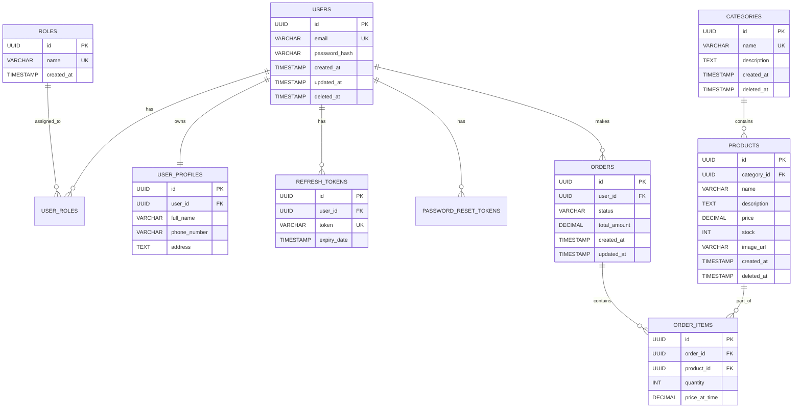

# Entity Relationship Diagram (ERD)

Aplikasi ini menggunakan PostgreSQL dengan desain relasional yang dinormalisasi dengan baik. Skema ini dikelola secara penuh menggunakan Flyway migrations.

```mermaid
erDiagram
    USERS ||--o{ USER_ROLES : has
    ROLES ||--o{ USER_ROLES : assigned_to
    USERS ||--|| USER_PROFILES : owns
    USERS ||--o{ REFRESH_TOKENS : has
    USERS ||--o{ PASSWORD_RESET_TOKENS : has
    USERS ||--o{ ORDERS : makes

    CATEGORIES ||--o{ PRODUCTS : contains
    PRODUCTS ||--o{ ORDER_ITEMS : part_of
    ORDERS ||--o{ ORDER_ITEMS : contains

    USERS {
        UUID id PK
        VARCHAR email UK
        VARCHAR password_hash
        TIMESTAMP created_at
        TIMESTAMP updated_at
        TIMESTAMP deleted_at
    }

    ROLES {
        UUID id PK
        VARCHAR name UK
        TIMESTAMP created_at
    }

    USER_PROFILES {
        UUID id PK
        UUID user_id FK
        VARCHAR full_name
        VARCHAR phone_number
        TEXT address
    }
    
    REFRESH_TOKENS {
        UUID id PK
        UUID user_id FK
        VARCHAR token UK
        TIMESTAMP expiry_date
    }

    PRODUCTS {
        UUID id PK
        UUID category_id FK
        VARCHAR name
        TEXT description
        DECIMAL price
        INT stock
        VARCHAR image_url
        TIMESTAMP created_at
        TIMESTAMP deleted_at
    }

    CATEGORIES {
        UUID id PK
        VARCHAR name UK
        TEXT description
        TIMESTAMP created_at
        TIMESTAMP deleted_at
    }

    ORDERS {
        UUID id PK
        UUID user_id FK
        VARCHAR status
        DECIMAL total_amount
        TIMESTAMP created_at
        TIMESTAMP updated_at
    }

    ORDER_ITEMS {
        UUID id PK
        UUID order_id FK
        UUID product_id FK
        INT quantity
        DECIMAL price_at_time
    }
```
