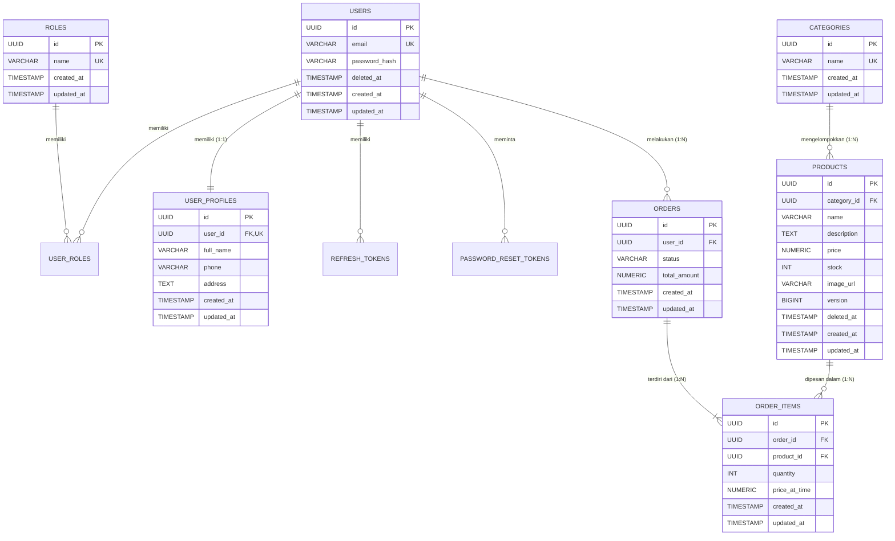

# 🗄️ Dokumentasi Skema Basis Data

Aplikasi ini menggunakan PostgreSQL 16 dengan skema yang dikelola melalui **Flyway Database Migration**. Semua primary key bertipe UUID v4 dan memenuhi kaidah Normalisasi Bentuk Normal Ketiga (3NF).

---

## 1. Diagram Relasi Entitas (ERD)

---

## 2. Rincian Tabel Domain

### 1. `roles`
Menyimpan daftar peran pengguna (`ROLE_ADMIN`, `ROLE_CUSTOMER`).

### 2. `users`
Menyimpan akun pengguna utama dengan email unik, password hash BCrypt (strength 12), dan dukungan soft delete (`deleted_at`).

### 3. `user_roles`
Tabel pivot N:M yang menghubungkan `users` dan `roles`.

### 4. `user_profiles`
Relasi 1:1 dengan `users` untuk menyimpan informasi profil seperti nama lengkap, nomor telepon, dan alamat domisili.

### 5. `categories`
Menyimpan kategori produk dengan nama unik.

### 6. `products`
Menyimpan data produk dengan relasi N:1 ke `categories`, kolom `stock`, kolom `version` (optimistic locking), dan soft delete (`deleted_at`).

### 7. `orders`
Menyimpan transaksi pembelian dengan status pemesanan (`PENDING`, `PAID`, `SHIPPED`, `DELIVERED`, `CANCELLED`) dan relasi N:1 ke `users`.

### 8. `order_items`
Menyimpan baris item dalam order, mengabadikan harga saat beli (`price_at_time`) dan jumlah `quantity`.

### 9. `refresh_tokens` & `password_reset_tokens`
Tabel pendukung autentikasi untuk refresh session dan reset password yang aman (SHA-256 hash).

---

## 3. Fitur Keamanan Basis Data
1. **UUID v4**: Semua primary key tidak berurutan, mencegah ID Enumeration / Scraping.
2. **Soft Delete**: Data user dan produk tidak dihapus secara fisik (`deleted_at IS NULL`).
3. **Auditing**: Kolom `created_at` dan `updated_at` di setiap tabel domain.
4. **Optimistic & Pessimistic Locking**: Mencegah race condition pada stok produk saat pemesanan massal.

---

## 4. Riwayat Migrasi Flyway (Version History)

| Migrasi | File SQL | Keterangan Evolusi Skema |
| :--- | :--- | :--- |
| **V1** | `V1__Init_Tables.sql` | Inisialisasi skema awal (Roles, Users, User_Roles, User_Profiles, Categories, Products, Orders, Order_Items). |
| **V3** | `V3__Add_Image_Url_To_Products.sql` | Penambahan kolom `image_url` pada tabel `products`. |
| **V4** | `V4__Create_Token_Tables.sql` | Penambahan tabel `refresh_tokens` dan `password_reset_tokens`. |
| **V5** | `V5__Add_Version_Column_To_Products.sql` | Penambahan kolom `version` pada tabel `products` untuk JPA Optimistic Locking. |
| **V6** | `V6__Seed_Data.sql` | Data seeding master roles, user admin, customer, kategori, dan katalog produk. |

