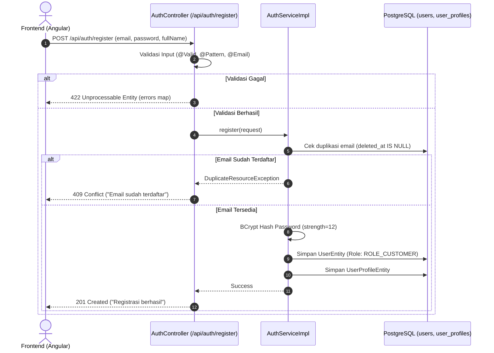
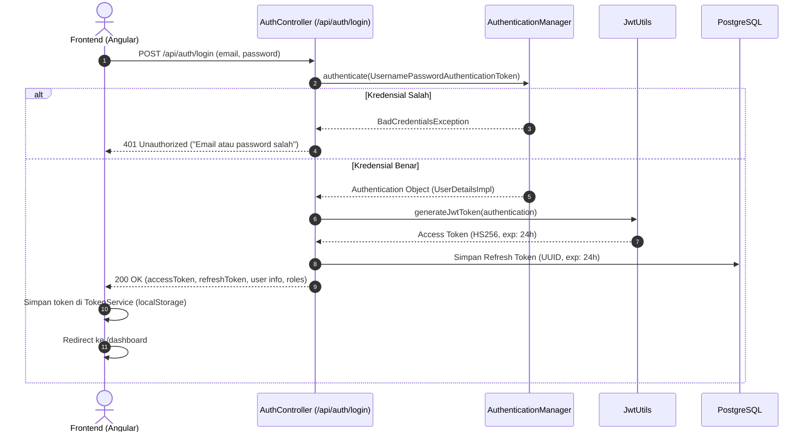
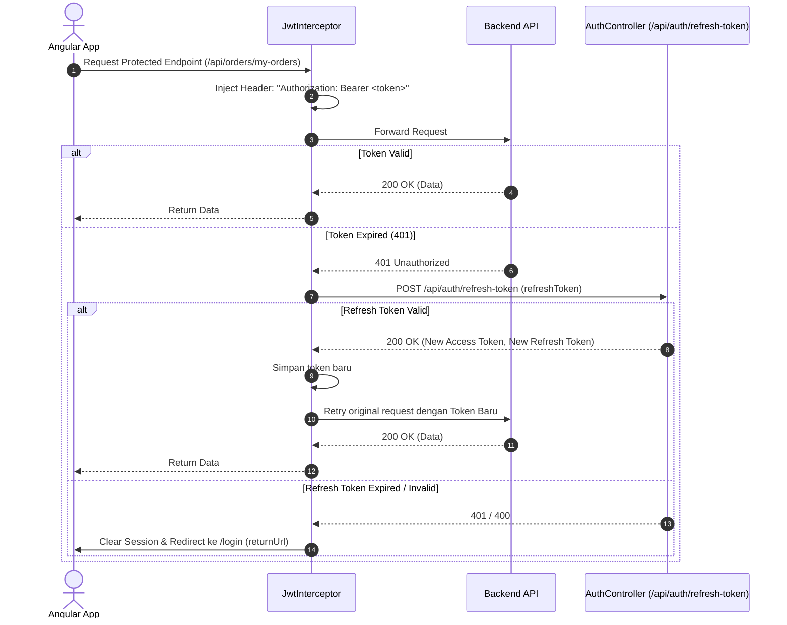

# 🔄 Flowchart: Authentication & Authorization Flow

Dokumentasi diagram alur autentikasi dan otorisasi menggunakan Spring Security + JWT Stateless sesuai Rule 83.

## 1. Flowchart Registrasi User

---

## 2. Flowchart Login & Token Issuance

---

## 3. Flowchart JWT Interception & Refresh Token

