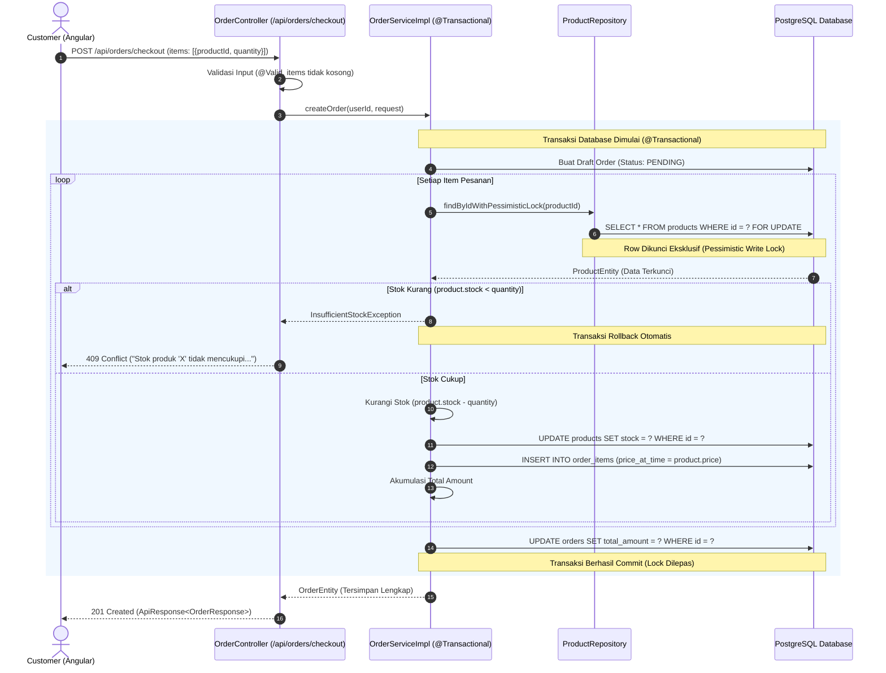

# 🛒 Flowchart: Checkout & Concurrency Control Flow

Dokumentasi alur checkout pesanan dengan **Pessimistic Locking**, validasi stok, dan atomic transaction sesuai Rule 24, 25, dan 83.

## 1. Flowchart Checkout Transaksi

## 2. Poin Kunci Keamanan & Integritas:
1. **Pessimistic Locking (`SELECT FOR UPDATE`)**: Mencegah race condition (TOCTOU) saat multi-user memesan item terakhir secara bersamaan.
2. **Atomic Transaction (`@Transactional`)**: Jika salah satu produk habis di tengah proses multi-item, seluruh order di-rollback otomatis dan stok item sebelumnya tidak berkurang.
3. **Price Freeze (`price_at_time`)**: Harga produk disimpan saat pesanan dibuat agar perubahan harga produk di masa depan tidak mengubah total tagihan pesanan lama.
